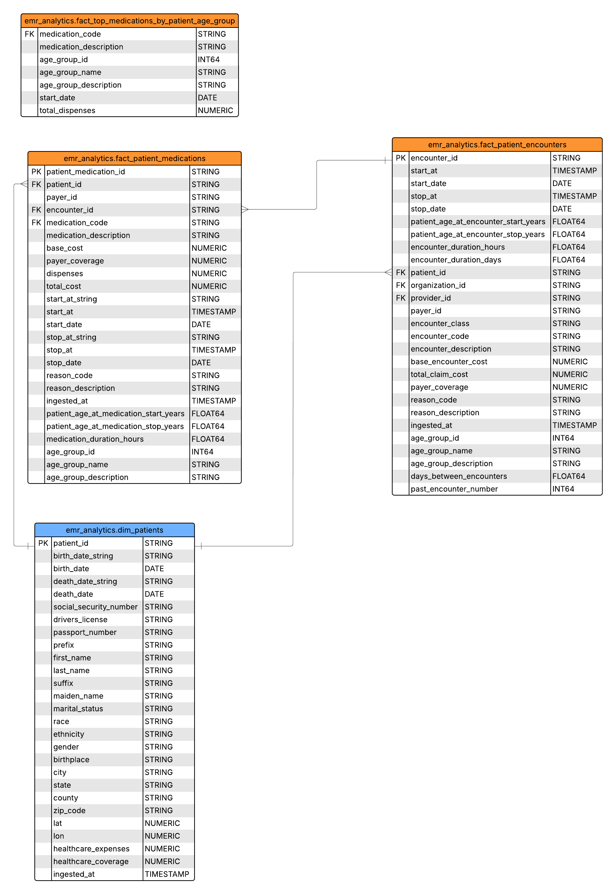

# Electronic Medical Records Analytics Pipeline


## Problem Statement
Healthcare organizations face significant challenges in analyzing Electronic Medical Records (EMR) data across multiple clinical facilities:
- Need to unveil trends or monitor larger scale clinical data, like prescription patterns and diagnosis trends
- Lack of standardized analytics capabilities across different healthcare facilities
- Difficulty in aggregating data for population health management
- Need for a clinical-facility agnostic way of analyzing EMR data to bring insights at community, state, or country level

## Objective
This project implements a data pipeline for healthcare analytics with the following goals:
- Build a scalable data pipeline to ingest EMR data from multiple clinical facilities into a single analytics solution
- Transform raw EMR data into structured, analytics-ready data models
- Create standardized marts for clinical insights across patient demographics, encounters, conditions, and medications
- Provide a foundation for advanced healthcare analytics and reporting

For testing and demonstration purposes, this project uses [Synthea™](https://synthea.mitre.org/) to generate synthetic patient records that do not contain real patient data but accurately reflect real-world clinical scenarios.

## Data Pipeline Architecture


### Workflow Orchestration with [Apache Airflow](https://airflow.apache.org/)
- Manages the entire data pipeline workflow
- Schedules and monitors data ingestion, transformation, and loading processes
- Integrates with dbt Core via [Astronomer Cosmos](https://www.astronomer.io/cosmos/) for analytics transformations
- Provides visibility into pipeline success/failures


### Ingestion from [Synthea™](https://synthea.mitre.org/) 
- Extracts synthetic patient data generated by Synthea
- Processes clinical data including:
  - Patient demographics
  - Encounters/visits
  - Conditions/diagnoses
  - Medications/prescriptions
  - Providers and organizations

### Storage - Google Cloud Storage (GCS)
- Raw data landing zone for EMR data
- Provisioned automatically via [Terraform](https://developer.hashicorp.com/terraform)
- Organized with partitioning for efficient data management


### Data Warehouse - BigQuery
- Database engine for EMR data transformations
- Provisioned and configured via [Terraform](https://developer.hashicorp.com/terraform)

### Analytics Transformations - [dbt Core](https://docs.getdbt.com/docs/core/about-core-setup)
- Runs within Airflow using Cosmos integration
- Implements a three-layer transformation approach:

|  | **Staging** | **Intermediate** | **Marts** |
|--------|-------------|------------------|-----------|
| **Purpose** | Data type validation and conversions<br><br>Enforce naming conventions | In-row calculations<br><br>Deduplication from incremental ingestion | Aggregate calculations<br><br> Star Schema and Report-driven granularity |
| **Materialization** | Views | Incremental tables | Tables and Views |

### Visualization - Looker Studio
- Interactive dashboards for healthcare analytics


## Data Lineage

### Medications


### Encounters


### Conditions


## Data Mart ERD

The data mart implements a healthcare-specific star schema with the following key entities:


### Dimension Tables
- `dim_patients`: Patient demographics and identifiers
- `dim_organizations`: Healthcare facilities information
- `dim_conditions`: Standardized medical conditions and diagnoses, SNOMED CT
- `dim_medications`: Pharmaceutical products and prescribed medications, SNOMED CT

### Fact Tables

- `fact_patient_conditions`: Patient diagnoses 
- `fact_patient_encounters`: Patient visits and clinical encounters
- `fact_patient_encounter_readmissions`: Analysis of patient readmission patterns
- `fact_patient_encounters_by_month`: Monthly aggregation of patient encounters by healthcare facility, specialty, and encounter class to analyze visit volume trends and seasonal patterns
- `fact_patient_medications`: Medications prescribed to patients
- `fact_top_medications_by_patient_age_group`: Analysis of prescription patterns by demographics

### Conditions 


### Medications


### Encounters


## How to Run

### Download Repository
```bash
git clone git@github.com:joseph-higaki/emr_data_pipeline.git
cd emr_data_pipeline
```

### Google Cloud Setup
1. Create a new Google Cloud project (e.g., `emr-data-pipeline`)
2. Enable required APIs:
   - BigQuery API
   - Cloud Storage API
   - IAM API

### Google Cloud Credentials
Create service accounts with the following permissions:

| Purpose | Credential File | Required Roles |
|---------|----------------|---------------|
| Terraform Infrastructure | `/workspaces/emr_data_pipeline/.gcp.auth/terraform/google_credentials.json` | - BigQuery Admin<br>- Storage Admin<br>- Service Account User |
| Data Ingestion | `/workspaces/emr_data_pipeline/.gcp.auth/airflow-ingestion/google_credentials.json` | - Storage Object User<br>- BigQuery Data Editor |
| dbt Analytics | `/workspaces/emr_data_pipeline/.gcp.auth/dbt-analytics/google_credentials.json` | - BigQuery Data Editor<br>- BigQuery Job User<br>- Storage Object Viewer |

### Open Folder in Dev Container
This project is configured to run in a VS Code Dev Container with all dependencies pre-installed:

1. Install VS Code and the Remote - Containers extension
2. Open the project folder in VS Code
3. Click "Reopen in Container" when prompted, or use the command palette (F1) and select "Remote-Containers: Reopen in Container"

### Provision Cloud Infrastructure
```bash
cd /workspaces/emr_data_pipeline/terraform
make init
make plan
make apply
```

This will create:
- GCS buckets for raw and processed data
- BigQuery dataset

### Start Airflow with Docker Compose
```bash
cd /workspaces/emr_data_pipeline/airflow
make up 
```

### Access Airflow UI
Open your browser and navigate to http://localhost:8080
- Username: airflow
- Password: airflow

### Run the Pipeline
1. In the Airflow UI, navigate to DAGs
2. Locate the `emr_analytics_pipeline_dag` DAG
3. Click the "Play" button to trigger a manual run
4. Monitor progress through the Airflow UI

### Analytics Reports
After the pipeline completes, access the Looker Studio dashboards at:
[EMR Analytics Dashboard](https://lookerstudio.google.com/u/0/reporting/2989b4e9-80c2-4747-9f60-f3e114da9943/page/7SrGF)

* It might not be active as I deleted the cloud infra shortly after the project submission
#### Sample Dashboard Screenshots


### Project Structure
```
emr_data_pipeline/
├── airflow/                      # Airflow configuration and DAGs
│   ├── dags/                     # Airflow DAG definitions
│   │   └── dbt/                  # dbt project for transformations
│   │       └── emr_analytics/    # Main dbt project
│   │           ├── models/       # dbt models (staging, intermediate, marts)
│   │           ├── macros/       # Custom dbt macros
│   │           └── seeds/        # Static reference data
├── scripts/                      # Utility scripts
│   ├── emr_ingestion/            # Data ingestion scripts
│   └── emr_transformation/       # Transformation scripts
├── terraform/                    # Infrastructure as Code
```

## Next Steps

The following enhancements are recommended as logical next steps for this project:

- **Testing Enhancement**
  - Implement unit and integration tests for ingestion and transformation scripts

- **Cloud Deployment - Compute Engine**
  - Run Airflow (with dbt) and processing scripts in Google Cloud Compute Engine

- **Documentation**
  - Generate and publish Analytics Engineering documentation using dbt docs
  - Create comprehensive data dictionary and lineage documentation

- **DataOps**
  - Set up development, staging, and production environments
  - Enable CI/CD with GitHub Actions for automated testing and deployment

- **Data Generation Improvements**
  - Create a configurable Synthea data generation task before ingestion
  - Support seed-based generation for reproducible datasets
  - Use parameters for reference date and demographic distributions for generating non-US data 

- **Format Compatibility**
  - Extend generation and transformation capabilities to support FHIR format 

## Acknowledgments

This project uses [Synthea™](https://synthea.mitre.org/), an open-source synthetic patient generator that models the medical history of synthetic patients. Synthea™ uses publicly available data to generate synthetic patients with realistic but not real medical histories. This project does not contain or use any real protected health information (PHI).


